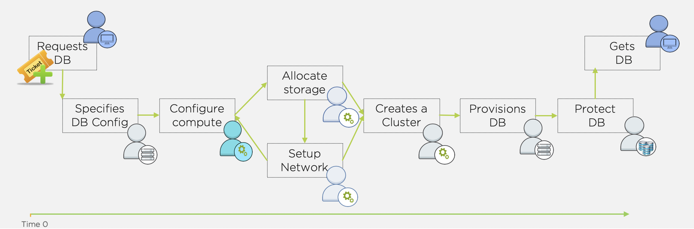

.. _deploy_oracle:

-----------------
Deploying Oracle
-----------------

Traditional database VM deployment resembles the diagram below. The process generally starts with a IT ticket for a database (from Dev, Test, QA, Analytics, etc.). Next one or more teams will need to deploy the storage resources and VM(s) required. Once infrastructure is ready, a DBA needs to provision and configure database software. Once provisioned, any best practices and data protection/backup policies need to be applied. Finally the database can be handed over to the end user. That's a lot of handoffs, and the potential for a lot of friction.

Whereas with a Nutanix cluster and Era, provisioning and protecting a database should take you no longer than it took to read this intro.

Source Oracle VM
++++++++++++++++++++++

**In this lab you will deploy a Oracle VM, by cloning a source Oracle 19c Source VM. This VM will act as a master image to create a profile for deploying additional Oracle VMs using Era.**

This VM is running Oracle 19c with April PSU patches applied.

#. In **Prism Central**, select :fa:`bars` **> Virtual Infrastructure > VMs**.

#. Change the name of your assigned VM to *Initials*\_Oracle19cSource

#. Select the radio button for your assigned Oracle Source VM, and click **Actions > Update**.

Preparing the Source Oracle VM
+++++++++++++++++++++++++++++++++++++++++

As the original Oracle VM has been prebuilt for an older version of Era, we need to make some small preparations so it can work with the current 2.0.0 version of Era. The following has to be performed:

#. Open the console of your (or use ssh) Source VM *Initials*\ **-Oracle19cSource**
#. Login to the VM using the **nutanix** user with password **nutanix/4u**
#. Open a terminal console via **Applications -> Terminal**
#. Run the below command. Type the nutanix password if asked for. 

   .. code-block:: bash
      sudo yum install -y http://10.42.194.11/workshop_staging/sshpass-1.06-2.el7.x86_64.rpm

   .. figure:: images/1d.png

#. After the installation was successful logout of the VMs

   .. figure:: images/1c.png

Your VM is now ready for the new version of Era.

.. note::
   
   This step will be solved in the 2.1 version of Era.

Clone the source Oracle VM
++++++++++++++++++++++++++

During a later phase in the workshop (pathcing an Oracle server with Era) we need a Clone of the Source Oracle server, so we are going to create a clone....

#. After having **only** the Source Oracle VM (*Initials*\ **-Oracle19cSource**) selected, click **Actions > Clone**.

   .. figure:: images/1b.png

#. Fill out the following fields:

   - **Number Of Clones** - 1
   - **Name** - *Initials*\ **-Oracle19cSource-Patched**
   - **Description** - (Optional) Description for your VM.
   - **vCPU(s)** - 2
   - **Number of Cores per vCPU** - 1
   - **Memory** - 8 GiB

#. Click **Save** to create the VM.

#. Make sure both VMs are **Powered On** before proceeding.

Register Oracle Database Server with Era
++++++++++++++++++++++++++++++++++++++++

In this exercise, you will register your Cloned VM and register it as version 1.0 of your Oracle 19c Software Profile. The Software Profile is a template containing both the operating system and database software, and can be used to deploy additional database servers.

#. In **Era**, select **Database Servers** from the dropdown menu and **List** from the lefthand menu.

#. Click **+ Register** and fill out the following **Database Server** fields:

   - **Oracle**
   - **Nutanix Cluster** - EraCluster
   - **IP Address or Name of VM** - *Initials*\ **-Oracle19cSource**
   - **Era Drive User** - oracle
   - **Oracle Database Home** - /u02/app/oracle/product/19.0.0/dbhome_1
   - **Grid Infrastructure Home** - /u01/app/19.0.0/grid
   - **Provide Credentials Through** - Password
   - **Password** - Nutanix/4u

   .. note::

      The Era Drive User can be any user on the VM that has sudo access with NOPASSWD setting on Linux machines. Era will use this user's credentials to perform various operations, such as taking snapshots.

      Oracle Database Home is the directory where the Oracle database software is installed, and is a mandatory parameter for registering a database server.

      Grid Infrastructure Home is the directory where the Oracle Grid Infrastructure software is installed. This is only applicable for Oracle RAC or SIHA databases.

   .. figure:: images/2a.png

#. Click **Register**

#. Select **Operations** to monitor the registration. This process should take approximately 5 minutes. Wait for the registration operation to successfully complete before moving on.

   Once the *Initials*\ **-Oracle19cSource** server has been registered with Era, we need to create a software profile in order to deploy additional Oracle VMs.

#. Select **Profiles** from the dropdown menu and **Software** from the lefthand menu.

#. Click **+ Create** and fill out the following fields:

   - **Oracle -> Single Instance Database**
   - **Profile Name** - *Initials*\ _ORACLE_19C
   - **Profile Description** - (Optional)
   - **Software Profile Version Name** - *Initials*\ _ORACLE_19C (1.0)
   - **Software Profile Version Description** - (Optional)
   - **Nutanix Cluster** - EraCLuster
   - Select your registered Database server *Initials*\ **-Oracle19cSource**

   .. figure:: images/3a.png

#. Click **Next**

#. Click **Create**.

#. Select **Operations** to monitor the registration. This process should take approximately 5-10 minutes.

   .. figure:: images/3b.png

Register Your Oracle Database
+++++++++++++++++++++++++++++

#. In **Era**, select **Databases** from the dropdown menu and **Sources** from the lefthand menu.

   .. figure:: images/11.png

#. Click **+ Register** and fill out the following fields:

   - **Oracle -> Single Instance Database**
   - **Database is on a Server that is:** - Registered
   - **Nutanix Cluster** - EraCluster
   - **Registered Database Server VMs** - Select your registered *Initials*\ **-Oracle19cSource**

   .. figure:: images/12a-1.png

#. Click **Next**

   - **Database Name in Era** - *Initials*\-orcl
   - **Description** - Optional
   - **SID** - orcl19c

   .. note::

     The Oracle System ID (SID) is used to uniquely identify a particular database on a system. For this reason, one cannot have more than one database with the same SID on a computer system. When using RAC, all instances belonging to the same database must have unique SID's.

   .. figure:: images/13a.png

#. Click **Next**

   - **Name** - *Initials*\-orcl_TM
   - **Description** - Optional
   - **SLA** - DEFAULT_OOB_BRASS_SLA (no continuous replay)

   .. figure:: images/14a.png

#. Click **Register**

#. Select **Operations** to monitor the registration. This process should take approximately 3-5 minutes. Please wait till the process has ended before moving on....
